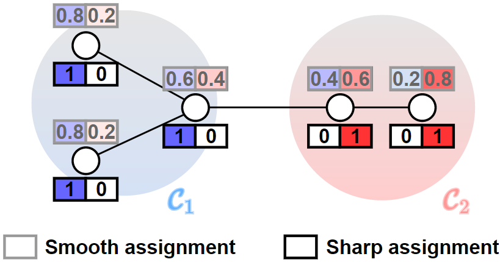

# Graph-Neural-Network-

Tensorflow and Pytorch implementation of a Graph Neural Network (GNN) model, referred to as GNN+ in this documentation.

The GNN+ model has versatile applications, including **vertex clustering** and **graph classification**. It excels in creating precise cluster assignments and can be a valuable tool for various graph-related tasks.

# Model Description
GNN+ comprises two essential components:

### GNNConv
The GNNConv layer is a message-passing layer designed to minimize the $L_1$-norm difference between features of adjacent nodes. It updates node features based on the graph topology and hyperparameters, leading to improved cluster assignments.

### CheegerCutPool
The CheegerCutPool is a graph pooling layer equipped with an internal MLP. It calculates cluster assignments and produces coarsened graphs for further processing.

# Downstream Tasks
GNN+ is suitable for both unsupervised vertex clustering and supervised graph classification. Its flexibility allows it to tackle a wide range of tasks in graph analysis.

### Vertex Clustering
In the unsupervised task of vertex clustering, GNN+ partitions vertices into clusters based on their features and graph topology. The model is trained using an unsupervised loss.

### Graph Classification
Graph classification is a supervised task aiming to predict the class of each graph. GNN+ alternates GNNConv layers with graph pooling layers to extract global label information from vertex representations.

# Implementation

### Tensorflow
This implementation is based on the [Spektral](https://graphneural.network/) library and follows the [Select-Reduce-Connect](https://graphneural.network/layers/pooling/#srcpool) API.
To execute the code, first install the conda environment from [tf_environment.yml](tensorflow/tf_environment.yml)

    conda env create -f tf_environment.yml

The ``tensorflow/`` folder includes:

- The implementation of the [GNNConv](/tensorflow/GNNConv.py) layer
- The implementation of the [CheegerCutPool](/tensorflow/CheegerCutPool.py) layer
- An example script to perform the [clustering](/tensorflow/clustering.py) task
- An example script to perform the  [classification](/tensorflow/classification.py) task

### Pytorch
This implementation is based on the [Pytorch Geometric](https://pytorch-geometric.readthedocs.io/) library. To execute the code, first install the conda environment from [pytorch_environment.yml](pytorch/pytorch_environment.yml)

    conda env create -f pytorch_environment.yml

The ``pytorch/`` folder includes:

- The implementation of the [GNNConv](/pytorch/GNNConv.py) layer
- The implementation of the [CheegerCutPool](/pytorch/CheegerCutPool.py) layer
- An example script to perform the [clustering](/pytorch/clustering.py) task
- An example script to perform the  [classification](/pytorch/classification.py) task

### Spektral

GNN+ is now available on Spektral:

- [GNNConv](https://graphneural.network/layers/convolution/#gnnconv) layer,
- [CheegerCutPool](https://graphneural.network/layers/pooling/#cheegercutpool) layer,
- [Example script](https://github.com/danielegrattarola/spektral/blob/master/examples/other/node_clustering_gnnplus.py) to perform node clustering with GNN+.

